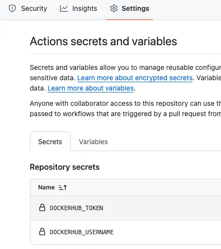

# 使用 Github Actions 发布 Bun.js 项目至 Docker Hub

## Configuration
你需要在 Github Settings 里的配置 secrets



## Action Script
在项目根目录下创建`.github/workflows/docker-image.yml`，添加如下代码

```yaml
name: Docker Image CI

on:
  push:
    branches: [ "master" ]
  pull_request:
    branches: [ "master" ]

jobs:

  build:
    runs-on: ubuntu-latest

    steps:
      - name: Set up QEMU
        uses: docker/setup-qemu-action@v3

      - name: Set up Docker Buildx
        uses: docker/setup-buildx-action@v3

      - name: Login to Docker Hub
        uses: docker/login-action@v3
        with:
          username: ${{ secrets.DOCKERHUB_USERNAME }}
          password: ${{ secrets.DOCKERHUB_TOKEN }}

      - name: checkout repository
        uses: actions/checkout@v4
      # 必须先 checkout 才能读到 package.json
      - name: get-npm-version
        id: package-version
        uses: martinbeentjes/npm-get-version-action@v1.3.1

      - name: Build and push
        uses: docker/build-push-action@v6
        with:
          push: true
          tags: |
            "${{ secrets.DOCKERHUB_USERNAME }}/dingtalk-bot:latest"
            "${{ secrets.DOCKERHUB_USERNAME }}/dingtalk-bot:${{ steps.package-version.outputs.current-version }}"
```

## Attention
> 必须先 checkout 代码，npm-get-version-action 才能读到 package.json
