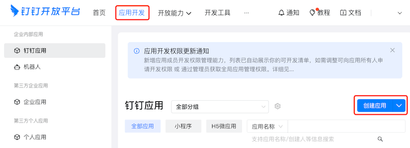
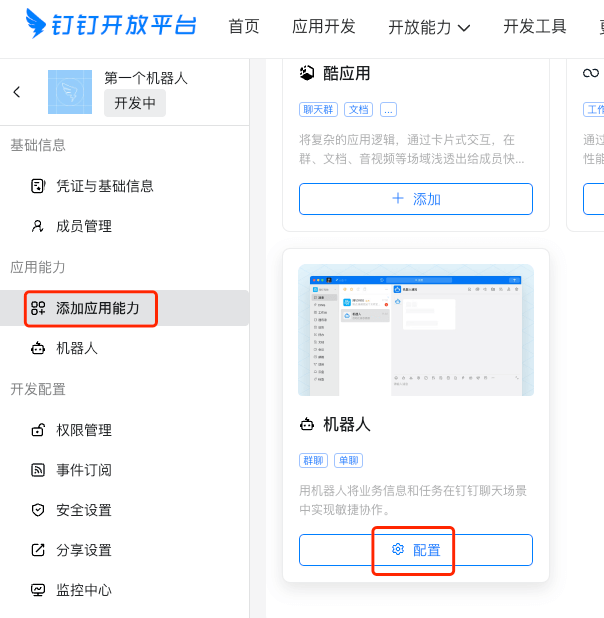
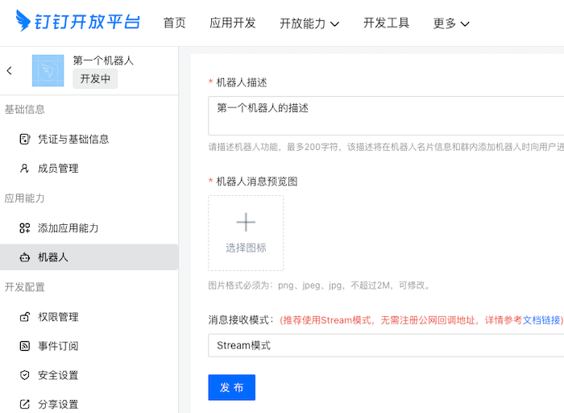
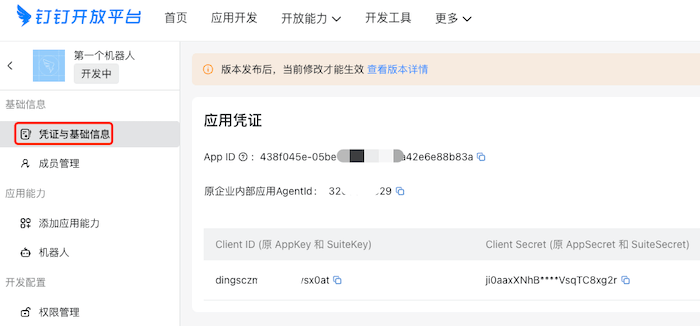
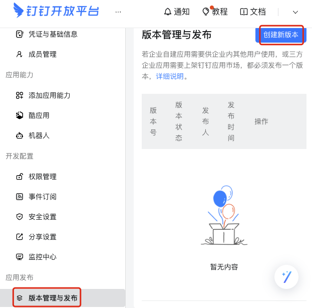
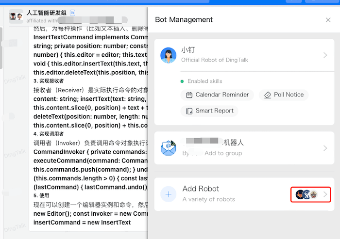

# 没想到开发一款钉钉机器人这么简单

## 一 、前置条件
1. 自己要注册个人的钉钉账号
2. 要加入一个钉钉的企业账号里或用自己的账号创建一个企业账号
3. 在 Dify https://cloud.dify.ai/apps 官网配置一个能对话的工作流，然后取得 api 地址和 key
4. 有一台服务器，用于部署  [dify-on-dingding-go](https://github.com/MAyang38/dify-on-dingding-go)

## 二、配置钉钉机器人
1. 登录 https://open-dev.dingtalk.com/
2. 创建一个应用，如图所示：



3. 添加钉钉应用添加机器人的能力，如图所示：



4. 配置机器人，如图所示：



5. 复制出这些 key，配置服务器上的配置文件，如图所示：



6. 配置完上述这些之后，一定要发布版本（并且以后每次修改机器人配置也要重新发布版本）



## 三、部署 dify-on-dingding-go
1. clone 代码，`git clone --depth=1 https://github.com/MAyang38/dify-on-dingding-go.git`
2. `cp .env_template .env`
3. 填写 .env 文件，如下代码所示(已做脱敏处理)
```dotenv
# Dify 的 API key
API_KEY=app-cuac7WxxxxGrgWoGVTVvVyyy
# Dify 的 API URL 地址
API_URL=https://cloud.dify.ai/v1
# 钉钉的 Client ID，见步骤 2.5
CLIENT_ID=dingcbnxxx7ocgd8yyyy
# 钉钉的 Client Secret，见步骤 2.5
CLIENT_SECRET=9obwQRFw1PSv7Zw0EuuXxxxxxjFlmQ5C5tiUBGh4wb4jTwQYYyyYYYyyY1GFxWn
Ding_Topic=/v1.0/im/bot/messages/get
Output_Type=Stream
```
4. 把 docker-compose.yaml 改换为如下代码(不需要暴露端口)
```yaml
services:
  app:
    build:
      context: .
      dockerfile: Dockerfile
    environment:
      REDIS_ADDR: redis:6379
      REDIS_PASSWORD: your_redis_password
    depends_on:
      - redis

  redis:
    image: "redis:6-alpine"
    volumes:
      - redis-data:/data
    command: ["redis-server", "--requirepass", "your_redis_password"]

volumes:
  redis-data:
```
5. 运行 `docker-compose up -d`

## 四、添加机器人到钉钉群组
1. 找到一个钉钉群组，点击群组设置，添加机器人，如图所示：




## 十、技术支持
- 加微信了解更多细节


