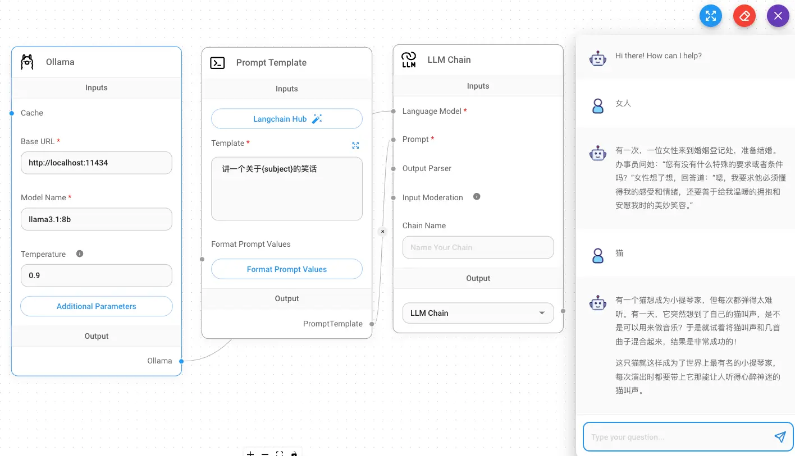
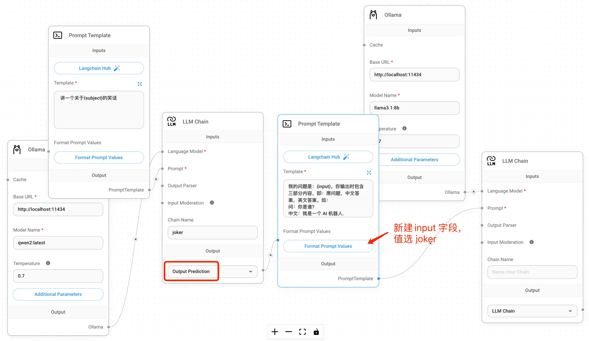

# 本地部署 Flowise

## 一、介绍
Flowise 是一个开源的 LLM 应用开发平台，可以轻松构建 LLM 应用。开源地址：https://github.com/FlowiseAI/Flowise ，官网：https://flowiseai.com

## 二、环境准备
Flowise 支持多种部署方式，例如源代码部署、Docker 部署、Docker Compose 部署等，这里以 Docker 部署为例，介绍如何部署 Flowise。
- 源代码部署：安装 Node.js 18.15+，最好是20
- Docker 部署：安装 Docker
- Docker Compose 部署：安装 Docker Compose

以上，三选一就好了。

## 三、本地 LLM
Flowise 支持多种 LLM，例如 OpenAI、Google PaLM、Ollama 等，下面的演示以 Ollama 为例。如果你的网络或地区可以直接使用 OpenAI，那么使用 OpenAI 也是没问题的。

## 四、部署
我们以 Docker 部署为例，部署命令如下：

`docker run -d --name flowise --net=host flowiseai/flowise:latest`

在浏览器中访问 http://localhost:3000

> 注意：由于 Docker 默认的网络是 bridge，所以需要使用 host 网络模式才能访问到主机的  http://localhost:11434 上的 Ollama API 服务。

## 五、配置
- Ollama 的地址：http://localhost:11434
- 模型名不能随便填，需要用 Ollama 命令行工具查看可用模型：`ollama list`
- Prompt 模板里的 `{subject}` 需要在 `Format Prompt Values` 里再配置一下:
```
{
  subject:{{question}}
}
```
- 配置完成后，点击右上角 Save，最好是导出一份 JSON 文件，方便以后导入。
- 点击右上方聊天按钮，就能像下图一样聊天了。

> 注意：如果我们在改 prompt 时，把 {subject} 改为了 {title}，那在 `Format Prompt Values` 里也一定要改为 
```
{
   title:{{question}}
}
```
> ，也就是要对应上。

## 六、效果图




## 七、API 调用
- 点击右上角代码按钮，可以看到支持非常多的调用方式，包括Embed(集成到网页里)、Python、JavaScript、Curl 等。
- 这里以 curl 为例，调用代码如下：
```shell
  curl http://localhost:3000/api/v1/prediction/f6cd24-8f57-c6-af1c-4e08f83 \
     -X POST \
     -d '{"question": "猴子"}' \
     -H "Content-Type: application/json"
```
- 调用结果如下：
```json
{
  "text":"有次，一个猴子和他的朋友在森林里玩耍，他突然拿起了一些香蕉放在自己的后背。他的朋友问他：“你为什么把香蕉放那么高？”猴子说：“这是因为我想试试我的新超人背包。”",
  "question":"猴子",
  "chatId":"ae354c1a-72fb-4001-8d6e-c9ade4f37411",
  "chatMessageId":"fc7ac41c-d8ed-40db-a6c6-f68bd4be66be",
  "sessionId":"ae354c1a-72fb-4001-8d6e-c9ade4f37411"
}
```

## 十、技术支持
- 加微信了解更多细节


